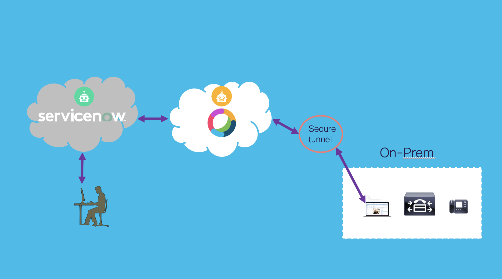

# ServiceNow-WebexTeams-CUCM Bot

### **Overview**

This Bot receives information from a ServiceNow(SNOW) ticket via a space in Webex Teams.  The information is used to provision an endpoint in CUCM.  The Bot first parses the infromation provided by SNOW.  Then the desired directory number (DN) is provisioned in CUCM.  Next, an unallocated endpoint in the desired physical location is found in CUCM.  The endpoint is updated with the correct DN, user information and the description is modified to include the location and the userid.

When the CUCM provisioning is complete, the Bot sends a completion message to the Webex Teams space and sends information to ServiceNow to close the ticket.

The premise for this Bot is the organization adding endpoints would connect the endpoints to the network in a location where users can stop by pickup the endpoint after they enter the information in the SNOW ticket.  The endpoints would be configured in CUCM with basic information and remain in an unregistered/unallocated state util the Bot needs an endpoint to fulfill the request.

### **Additional details:**

- The information needed to configure SNOW to send the information to Webex Teams can be found here:  https://github.com/pselker2/SNOW-WebexTeams-Infrastructure
- Cisco Unified Communications Manager (CUCM) version 11.5 is used in the Bot
- [ngrok](https://ngrok.io) is used as a secure tunnel to connect Webex Teams to the Bot.
- JavaScript is used for the Bot, [node.js](https://nodejs.org/en/)
- [Botkit](https://botkit.ai/docs/v4/reference/webex.html) is the framework used in the Bot.
- .env file is used to store information used in the Bot.

### **Diagram of solution**

